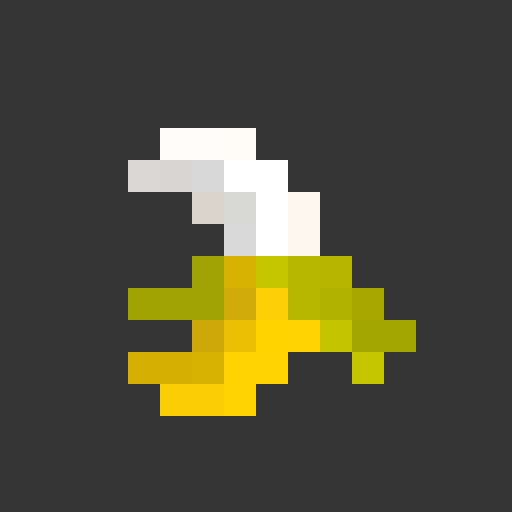

# BananaSlider

<br>
<div align='center'>



<a href="https://banana.kruceo.com">📚 <strong>Example</strong></a> ╽
<a href="https://home.kruceo.com">🧒🏼 <strong>Author</strong></a> ╽
<a href="https://home.kruceo.com/donation">🎁 <strong>Donation</strong></a>
</div>
<br>
<br>


# Summary

1. [Introduction](#introduction)
1. [Installation](#installation)
1. [Technologies](#technologies)
1. [Bundles](#bundles)
1. [Getting Started](#getting-started)
1. [HTML Directives](#html-directives)
    1. [Showtime](#showtime)
    2. [Animation Speed](#animation-speed)
    3. [Animation Direction](#animation-direction)
    4. [Animation Curve](#animation-curve)
    5. [Animation Movement](#animation-movement)
    6. [Hover Presets](#hover-action)
    7. [Initial Slide](#initial-slide)
3. [JavaScript API](#javascript-api)
    1. [move](#move-function)
    1. [Teleport (tp)](#tp-function)
    1. [getIndex](#getindex-function)
    1. [thread.stop](#stop-a-single-slider)
    1. [thread.start](#start-a-single-slider)
    1. [stopAllSliders](#stopallsliders-function)
    1. [restartAllSliders](#restartallsliders-function)

# Introduction

BananaSlider was created to make creating carousels simpler, faster and more intuitive, while still being very customizable.

# Technologies

* **Javascript** for internal mechanics;
* **HTML** as main structure;
* **CSS** for visual enhancement;

# Bundles

* EcmaScript (ES);
* CommonJS (CJS);
* TypeScript (TS);
* Content delivery network (CDN);

# Installation

```console
npm install kruceo/bananaslider
```

for CDN method use:

```html
<script src="https://banana.kruceo.com/dist/bundle.cdn.js"></script>
```


<br><br><br><br>

# Getting started

## Your first slider

```html
<slider>
  <slide>
    <h2>Your first slide!</h2>
  </slide>
  <slide>
    <h2>Your second slide!</h2>
  </slide>
  <slide>
    <h2>Your third slide!</h2>
  </slide>
</slider>

  <!-- If you just want a simple init, put this at the bottom of your "body" tag  -->
<script>
    initAllSliders();
</script>
```
<br><br>
# HTML Directives
This section show some ways to customize sliders with HTML 
## Showtime

```html
<slider cooldown="5000">
  <!-- 5 seconds -->
  <slide>
    <h2>5 seconds to change bro!</h2>
  </slide>
  <slide>
    <h2>More 5 seconds!</h2>
  </slide>
  <slide>
    <h2>Wait a little bit...</h2>
  </slide>
</slider>
```

To a stopped slide:

```html
<slider cooldown="0">
  <!-- it doesn't move, other than with "hover:'add'" attribute or js script commands -->
  <slide>
    <h2>I don't move any muscles</h2>
  </slide>
  <slide>
    <h2>More a eternity of seconds!</h2>
  </slide>
  <slide>
    <h2>wait a lot...</h2>
  </slide>
</slider>
```

To individual slide showtime set:

```html
<slider>
  <!-- if you don't set a cooldown to "slider" tag, the default is 1 second-->
  <slide cooldown="7000">
    <h2>I'm here for 7 seconds</h2>
  </slide>
  <slide cooldown="5000">
    <h2>I'm here for 5 seconds</h2>
  </slide>
  <slide cooldown="3000">
    <h2>I'm here for 3 seconds</h2>
  </slide>
</slider>
```
<br><br>
## Animation speed

```html
<slider speed="250">
  <!-- 0.25 seconds -->
  <slide>
    <h2>I'll complete this transition in 250 millis</h2>
  </slide>
  <slide>
    <h2>Is this fast?</h2>
  </slide>
  <slide>
    <h2>No...</h2>
  </slide>
</slider>
```
<br><br>
## Animation direction

```html
<slider direction="backward">
  <!-- "forward" is default -->
  <slide>
    <h2>I'll move to the right!</h2>
  </slide>
  <slide>
    <h2>All right?</h2>
  </slide>
  <slide>
    <h2>With you?</h2>
  </slide>
</slider>
```
<br><br>
## Animation curve

```html
<slider curve="cubic-bezier(1, 0, 0, 1)">
  <!-- Your animation style -->
  <slide>
    <h2>JS</h2>
  </slide>
  <slide>
    <h2>CSS</h2>
  </slide>
  <slide>
    <h2>HTML</h2>
  </slide>
</slider>
```
<br><br>
## Animation movement

```html
<slider movement="vertical">
  <!-- "vertical" and "horizontal"... "horizontal" is default -->
  <slide>
    <h2>I'll move to the top!</h2>
  </slide>
  <slide>
    <h2>Shooting stars</h2>
  </slide>
  <slide>
    <h2>:)</h2>
  </slide>
</slider>
```
<br><br>

## Hover action

```html
<slider hover="add">
  <!-- "add", "stop" or "none"... "stop" is default -->
  <slide>
    <h2>Put your mouse over me!</h2>
  </slide>
  <slide>
    <h2>BOOOOOOOO!</h2>
  </slide>
</slider>
```
<br><br>

## Initial slide

```html
<slider initial="1">
  <!-- Show 2023 first" -->
  <slide>
    <h2>2022</h2>
  </slide>
  <slide>
    <h2>2023</h2>
  </slide>
  <slide>
    <h2>2024</h2>
  </slide>
</slider>
```
<br><br>
# JavaScript API

All sliders are initialized on window load and indexed on "banana" object with your id attribute name, and you can find your slider calling the object "banana"...
<br> 

#### ***PS: If you don't give a id to your slide is set the default name and you can reach it like any other, the name is set like "slider1", "slider2"....***
<br><br>
## How to control your slider
Create a slider with a ID, like this:
```html
<slider id="my-slider">
  <!-- the obj name is "my-slider" -->
  <slide> 1 </slide>
  <slide> 2 </slide>
  <slide> 3 </slide>
  <slide> 4 </slide>
</slider>
```

##### Now you can control it calling `banana['my-slider']`

```html
<button onClick="banana['my-slider'].move(1)">+</button>
<button onClick="banana['my-slider'].move(-1)">-</button>
```
<br><br>
## **move** Function

move adds the parameter number to current slider index, try this:

```html
<button onClick="banana['my-slider'].move(1)">+1</button>
<button onClick="banana['my-slider'].move(-1)">-1</button>
<button onClick="banana['my-slider'].move(2)">+2</button>
<button onClick="banana['my-slider'].move(-2)">-2</button>
```
<br><br>
## **tp** Function

tp is acronym to "teleport" and do exactly this, a example:

```html
<button onClick="banana['my-slider'].tp(0)">1</button>
<button onClick="banana['my-slider'].tp(1)">2</button>
<button onClick="banana['my-slider'].tp(2)">3</button>
<button onClick="banana['my-slider'].tp(3)">4</button>
```
<br><br>
## **getIndex** Function

the getIndex function return the current slide that's showing:

```js
setInterval(()=>
{
  let i = banana['my-slider'].getIndex();
  console.log(i)
},1000)
```
<br><br>
## **thread.stop** Function

If you want stop a single and specific slider, you can do:

```js
banana['my-slider'].thread.stop();
```
<br><br>
## **thread.start** Function

If you want start a single and specific slider, you can do:

```js
banana['my-slider'].thread.start();
```
<br><br>
## **stopAllSliders** Function

Stop all sliders that are running, this does not delete the slider, if you restart the slider it will start at the index it stopped

```html
<button onclick="stopAllSLiders()">Stop</button>;
```
<br><br>
## **restartAllSliders** Function

It just restart all slider that is stopped, it doesn't regenerate the slider, this will start the slider at the last index it showed

```html
<button onclick="restartAllSliders()">Restart</button>;
```
<br><br>
## **Using the show event**

The most basic use of the event is with the attribute "onShow":

```html
<slider initial="1">
  <slide>
    <h2>I don't print anything</h2>
  </slide>
  <slide onShow="console.log('BANANA')">
    <h2>I print 'BANANA'</h2>
  </slide>
  <slide>
    <h2>I don't print anything</h2>
  </slide>
</slider>
```

You can set the show event like this:

```html
<slide id='slide1'>
    <h2>Print anything</h2>
</slide>
```

```javascript
document.querySelector("#slide1").addEventListener('show',(e)=>
{
    console.log('Anything');
})
```
<br><br>
## Author
Visit Kruceo website for more projects: <a href='https://home.kruceo.com'>home.kruceo.com
